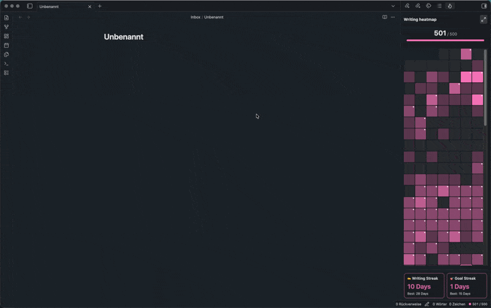
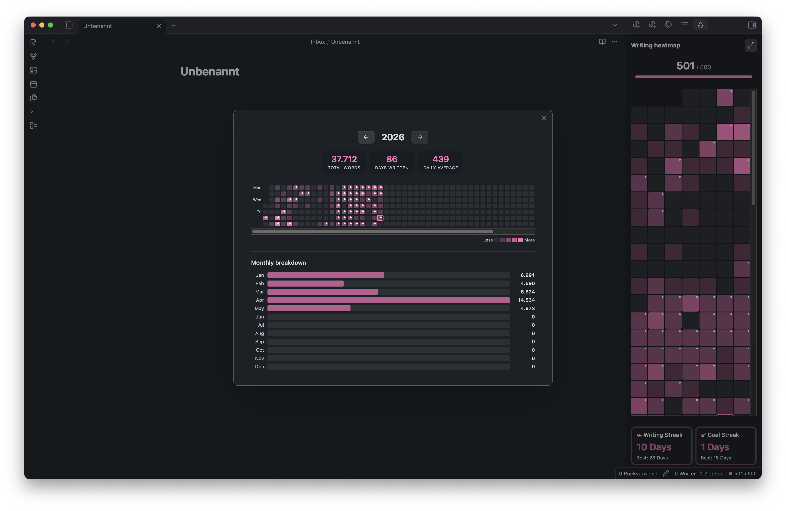
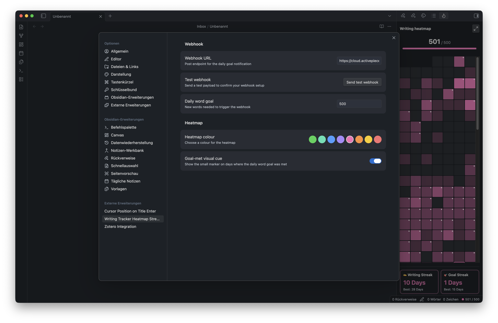

# Writing Tracker Heatmap Streaks

Writing Tracker Heatmap Streaks is an [Obsidian](https://obsidian.md) plugin that tracks the new words you write each day, sends a webhook when you hit your goal, and shows your writing history in a compact heatmap sidebar with a detailed stats view.



## Features

- Track daily new words instead of total file length.
- Exclude reference/generated-note folders or count only selected writing folders.
- Send a webhook when the configured daily word goal is reached.
- View a sidebar heatmap with today's count and current streaks.
- Click a sidebar heatmap day to open the matching daily note, with the active daily note highlighted in the heatmap.
- Open a detailed stats modal with yearly history and monthly totals.
- Import past history from the `obsidian-daily-stats` plugin.
- Import past word counts from configured daily notes.

## Installation

Install **Writing Tracker Heatmap Streaks** from Obsidian's community plugins browser:

1. Open **Settings -> Community plugins** in Obsidian.
2. Browse or search for **Writing Tracker Heatmap Streaks**.
3. Install and enable the plugin.

## Usage

The plugin tracks your current daily word count in the status bar. Words are counted as growth from each note's daily baseline, and if you delete older text below that baseline, the baseline lowers so future writing starts counting from the new length. The sidebar heatmap can be opened when needed, and each day is shaded based on how many words you wrote relative to your strongest writing day for that year.

Click a day in the sidebar heatmap to open its daily note. The plugin uses your Periodic Notes daily settings first, then Obsidian's core Daily Notes settings, and resolves the note from the configured folder and Moment-style date format. Date tokens follow Obsidian's locale, so localized month and weekday names such as `Mai` or `Dienstag` are supported. If the expected daily note is missing or daily notes are not configured, Obsidian shows a notice instead of failing silently.



Commands:

- `Open writing heatmap`
- `Open writing stats`
- `Show today's word count`
- `Import history from daily stats plugin`
- `Import word counts from daily notes`

Settings:

- **Webhook URL**: endpoint to call when the daily goal is met.
- **Daily word goal**: number of new words required before the webhook fires.
- **Heatmap colour**: choose one of the built-in color presets.
- **Goal-met visual cue**: show or hide the marker on days where the goal was reached.
- **Only include listed folders**: toggle folder filtering between excluding the listed folders and counting only the listed folders.
- **Folder list**: one folder path per line, such as `Zettelkasten/Notes/`. Changing the list or mode removes newly filtered notes from today's active count.

When the goal is reached, the plugin sends a `POST` request with a JSON payload like:

```json
{
  "event": "daily_word_goal_reached",
  "goal": 500,
  "actual": 512,
  "date": "2026-03-27",
  "timestamp": "2026-03-27T14:23:01.000Z",
  "test": false
}
```


## Data and privacy

- Plugin data is stored in your vault under `.obsidian/plugins/word-goal-webhook/data.json`.
- If you sync your vault with iCloud, Dropbox, OneDrive, or another file-sync service, make sure the plugin data file is fully synced and available locally before starting Obsidian. If the sync provider temporarily presents `data.json` as missing, empty, stale, or conflicted, Obsidian can load the plugin as if it were a fresh install and a later save may overwrite your previous progress.
- For iCloud specifically, keep your vault in `iCloud Drive/Obsidian/<Vault Name>`, mark the Obsidian folder as **Keep Downloaded** where available, avoid mixing iCloud with another sync service for the same vault, and consider Obsidian Sync or regular backups if the writing history is important to you.
- The plugin makes network requests only when you configure a webhook URL. It sends `POST` requests only to the URL you enter when your daily goal is reached or when you click **Send test webhook**.
- Webhook payloads include the event name, configured daily goal, actual word count, date, timestamp, and whether the payload is a test.
- Daily-note opening and daily-note word count import check only the expected daily-note paths from your configured folder and date format. The plugin does not enumerate every file in the vault.
- The plugin does not require an account, payment, ads, or telemetry.
- The source code in this repository is open source.

## Development

```bash
npm install
npm run build
npm run deploy:runtime
```

`npm run deploy:runtime` copies only `main.js`, `manifest.json`, and `styles.css` into the local Obsidian plugin folder and removes development-only files from that installed copy. Set `OBSIDIAN_PLUGIN_DIR` to deploy to a different vault.

Create releases by pushing a version tag that matches the manifest version. The GitHub release workflow builds from source, runs tests, uploads `main.js`, `manifest.json`, and `styles.css`, and creates GitHub artifact attestations for those release assets.

## License

[MIT](LICENSE)
